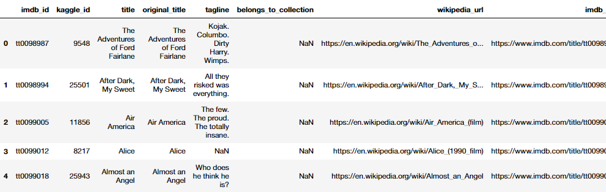

# Challenge - Movies: Extract, Transform, and Load

## Challenge - Overview

The goal of the module was to create an SQL database from three datasets, by combining their data into one main table. (We also imported other data into the SQL database, but the focus was on the main movie data table). We read in the data, performed analysis on it, cleaned it, combined it, and exported it to an SQL database we created. You can see this progression and the code behind the process [here](MODULE_data_analysis.ipynb). Below I detail the steps we took to follow the Extract, Transform, and Load process, as well as the challenge deliverables.

- **EXTRACT** - Through the course of the module we read in three movie datasets from different sources: Wikipedia movie data in JSON format, Kaggle movie data in CSV format, and MovieLens rating data (from Kaggle) also in CSV format.
- **TRANSFORM** - The bulk of the module was spent transforming the data into a usable format. The first focus was on the Wiki movie data that we transformed and cleaned up before making into a DataFrame. We removed unneeded columns and changed the data types to reflect the data they held, so we could interact with them properly. Once we had transformed the data to our liking, we converted all the raw data to DataFrames to ready for loading into the SQL database. We also joined the data into one conducive table to load only the required data into the database.
- **LOAD** - We used the `sqlalchemy` module to create an engine for SQL importing, and imported the main movie DataFrame we created into the database. We also imported the `ratings.csv` file into the database, which had to be done in chunks as the file contained over 26 million rows.

## Challenge - Deliverable 1

**Write and ETL Function to Read Three Data Files** - we created a function to read in the three datasets we were provided, by passing in the file paths/filenames as arguments.

```py
def extract_transform_load(wiki_data, kaggle_data, rating_data):
    # Read in the Kaggle metadata and MovieLens ratings CSV files as Pandas DataFrames.
    kaggle_metadata = pd.read_csv(kaggle_data, low_memory=False)
    ratings = pd.read_csv(rating_data)
    # Open the read the Wikipedia data JSON file.
    with open(wiki_data, mode='r') as f:
        wiki_movies_raw = json.load(f)
    # Read in the raw wiki movie data as a Pandas DataFrame.
    wiki_movies_df = pd.DataFrame(wiki_movies_raw)
    # Return the three DataFrames
    return wiki_movies_df, kaggle_metadata, ratings
```

## Challenge - Deliverable 2

**Extract and Transform the Wikipedia Data** - we transformed the Wikipedia movie data with our starting off point being the function we created in Deliverable 1. This followed a lot of the module with the focus being on understanding the code and learning to refactor it. The added section that was new was the `try-except` block we were tasked with adding. This block would display and name the error if the code was unable to find the regex query we passed, or had issues with dropping the duplicate rows.

```py
try:
    wiki_movies_df['imdb_id'] = wiki_movies_df['imdb_link'].str.extract(r'(tt\d{7})')
    wiki_movies_df.drop_duplicates(subset='imdb_id', inplace=True)        
except Exception as e:
    print(f'There was an error of type: {e}')
```

## Challenge - Deliverable 3

**Extract and Transform the Kaggle data** - this deliverable took the function to the next level by including our transformation of the Kaggle data too, and the merging of the tables into one main cohesive, informative DataFrame. We also renamed and rearranged the columns to best inform the reader of their use. Again, this was an experiment in refactoring the code from the module to prove understanding and confidence with our work. You can see an excerpt of our `movies_with_ratings_df` merged DataFrame below:



## Challenge - Deliverable 4

--missing

## Context

This is the result of Module 8 of the University of Toronto School of Continuing Studies Data Analysis Bootcamp Course. Following the guidance of the module we end up pushing this selection of files to GitHub.
